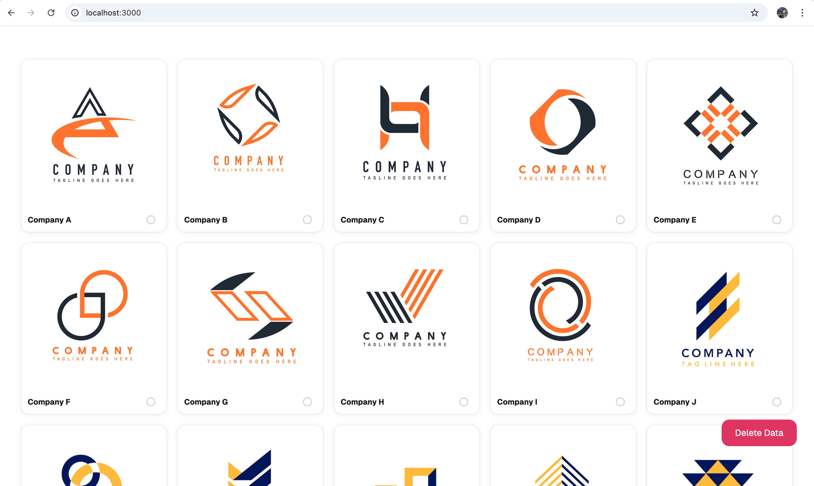
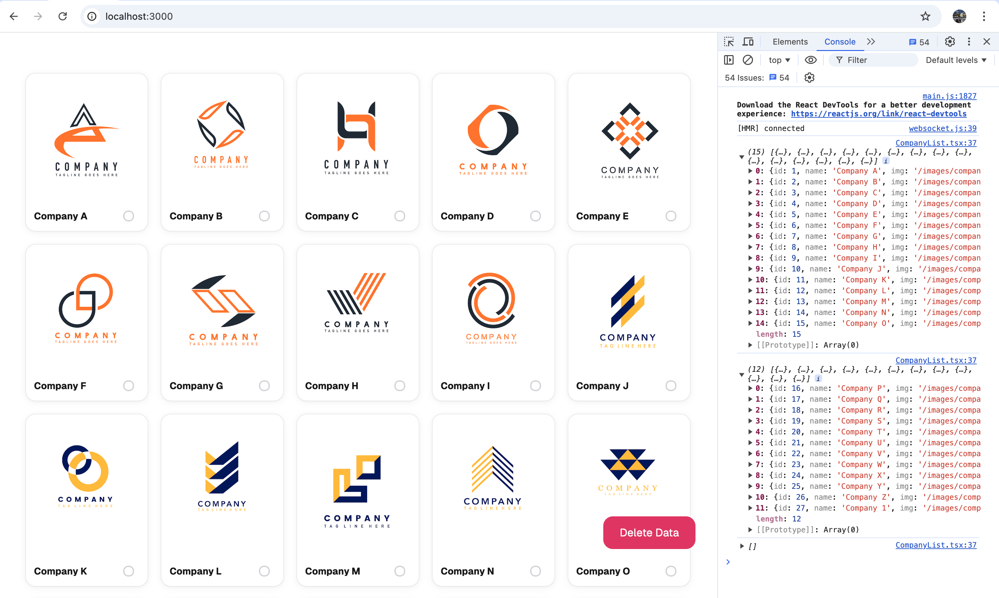
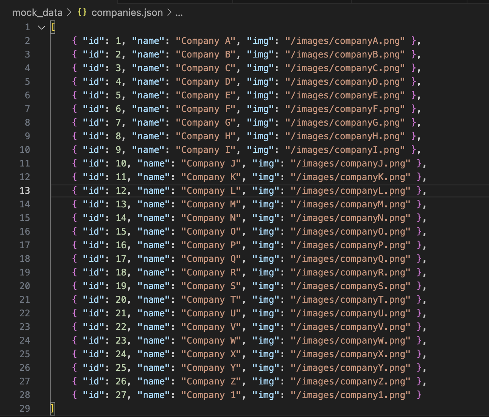

This is a [Next.js](https://nextjs.org/) project bootstrapped with [`create-next-app`](https://github.com/vercel/next.js/tree/canary/packages/create-next-app).

## Getting Started

First, install the packages:

```bash
npm i
```

Then, run the development server:

```bash
npm run dev
```

Open [http://localhost:3000](http://localhost:3000) with your browser to see the result.



It will initially display 15 items, then will fetch another set as you scroll down.

Added a console log to show the chuncked data being fetched from the API when scrolling down. You can check this by opening the browser DevTools `(fn + f12)`



You can add more data in `./mock_data/companies.json`

The added `img` property in the object are the company logos located in `./public/images` 


